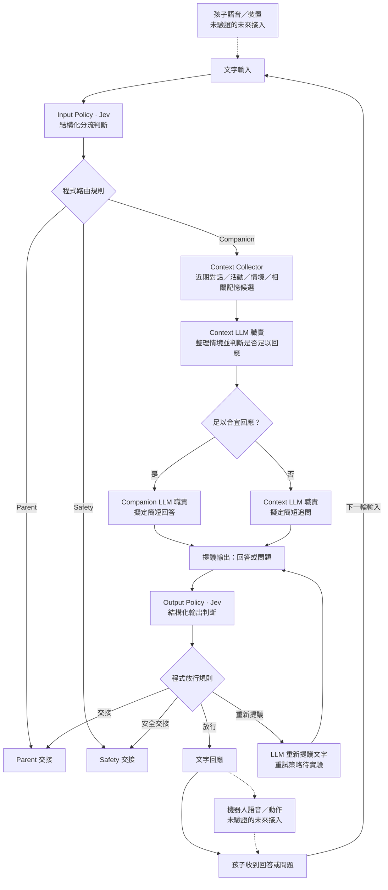

# Companion 對話流程（概念基線）

這張圖描述預期職責與交接，不表示已實作或已決定要拆成圖中數量的模型、服務。實線是本次要為下一個文字實驗提出的決策鏈；虛線是未驗證的長期產品接入邊界。

Jev 的定位參考 [TypeSafe 的公開介紹](https://typesafe.ai/blog/introducing-system-one-models-and-jev)：它給出結構化判斷，不生成給孩子的句子。圖中由程式規則決定路由與放行，LLM 擬定文字。這是待驗證的 Coami 設計假設，不是模型效果或安全性的保證。

「情境足夠」表示足以給出當下合宜的回應，不表示必須有所有可能的記憶資料。Parent／Safety 方塊只代表交接；觸發閾值、交接後流程、重新提議上限及故障處理均未在本基線定案。下一步的驗證方式見[文字對話實驗提案](experiments/text-companion-loop.md)。

交接的最小可觀察結果是記下目的地和原因，並停止 Companion 的一般回答。需要照顧者決定的要求（例如購買）交給 Parent，不能由 Coami 先作承諾；疑似受傷或危險的輸入交給 Safety，不能當成一般遊戲對話。孩子與照顧者實際收到什麼提示，仍須由各自的後續流程驗證。
