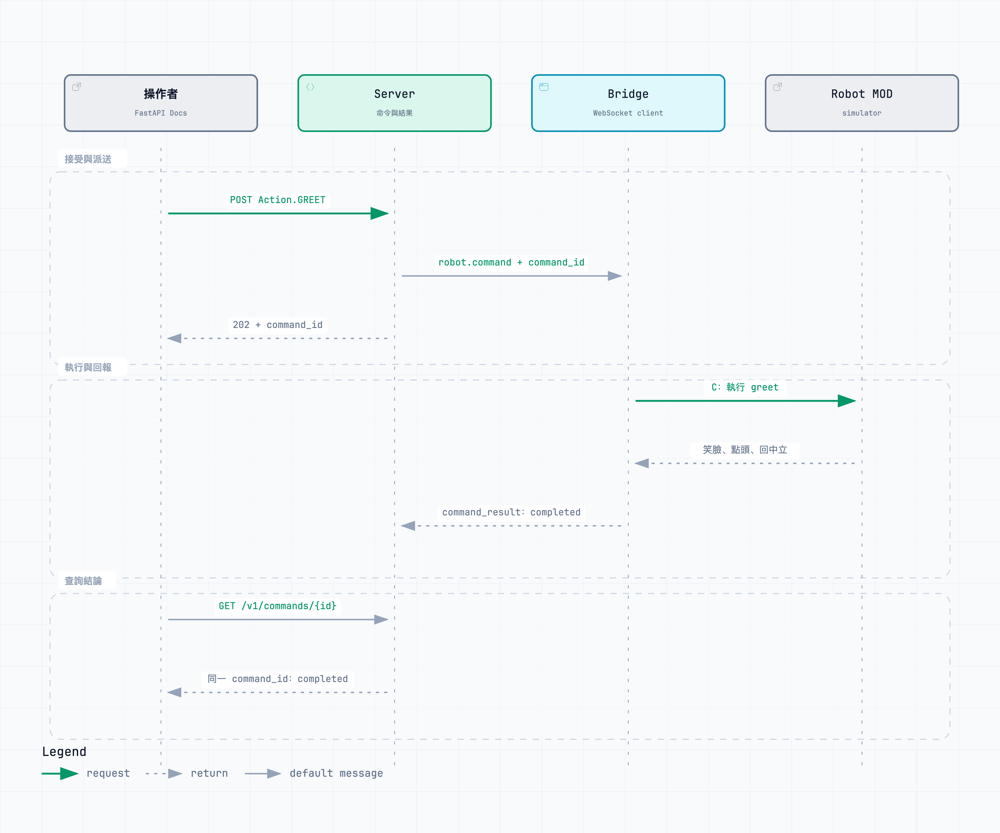

# E004：FastAPI Docs 派送具名 Robot 動作

## 問題與驗證責任

在不改動 production source 的前提下，操作者能否從 FastAPI Docs 對一台在線的 browser simulator 提交明確的 Enum `greet`，由 Server 建立並派送唯一 command，讓 Robot 執行既有笑臉、點頭、回中立，最後以同一 ID 查到終止結果？本實驗驗證的是 **API → WebSocket → simulator 動作 → result 的契約與關聯**，不是實機可用性或正式部署架構。

## 流程



```text
FastAPI Docs: POST /v1/devices/coami-sim-001/actions/greet
  → Server：驗證 Action Enum、裝置在線與 busy；建立 pending command_id
  → WebSocket robot.command：command_id + action=greet（直接命令無 event_id）
  → browser bridge：把 greet 映射至 simulator MOD C
  → MOD：笑臉、點頭、回中立，輸出 greet result
  → bridge：robot.command_result，保留同一 command_id
  → Server：completed 或 failed；GET /v1/commands/{command_id} 查詢

E003 回歸：MOD A → robot.event(event_id) → Server 固定 greet
  → 帶 event_id 的 robot.command → 同一執行與結果路徑
```

未知 Action、離線與 Server busy 在派送前拒絕，不建立 pending command。已接受的命令如送達失敗、執行失敗、斷線或逾時，則留下可查的 `failed` 原因。WebSocket send 成功只表示送出完成，不證明物理裝置已收到或完成。完整格式及邊界見 [protocol.md](contracts/protocol.md)。

## 程序與證據

依 [README.md](README.md) 啟動 E004 Server、browser simulator，待 MOD 安裝且 WebSocket 已連線，在 FastAPI Docs 選擇 `greet` 並按 Execute；觀察招呼畫面和 bridge 訊息，再查詢同一 command。接著按 A 驗證 E003 event 路徑。精確 ID、回應與檢查結果見 [full-loop.md](evidence/full-loop.md)，執行中畫面見 [greet.png](evidence/greet.png)。Archify 流程圖已通過 showcase 驗證（9/9、零 composition error／warning）並目視檢查；repo 只保留 PNG 與上述 Markdown 文字流程，沒有 HTML／JS 圖檔。

## 結論與限制

**Simulator 驗證通過（2026-09-23）**：FastAPI Docs Enum 僅含 `greet`；實際 Docs Execute 回傳 HTTP 202，bridge 執行招呼，GET 以同一 ID 回傳 `completed`。同次瀏覽器驗證的 A event 仍以其 event_id 和 command_id 完成。Python 13 個測試及 TypeScript 4 個測試通過，涵蓋拒絕、busy、送達／執行失敗、B 中斷、斷線、卡住的派送、timeout、late result、本機 busy 跨 session 和 E003 回歸；靜態檢查與建置也通過。這是技術實驗結論，尚待 PR human review，並非 production 升級決定。

未驗證實機 Wi-Fi／WebSocket client、真實馬達與姿勢容差、TLS／認證、跨進程持久化、多 Robot、多 Action、取消 API 與長時間可靠度。Server timeout 不代表 MOD 已停止或回中立；重連後若舊動作仍在執行，bridge 保留本機 busy 並可對新命令回 `failed/bridge_busy`。上正式時應以這些邊界另立驗證與設計決策，不直接搬移本 POC。
